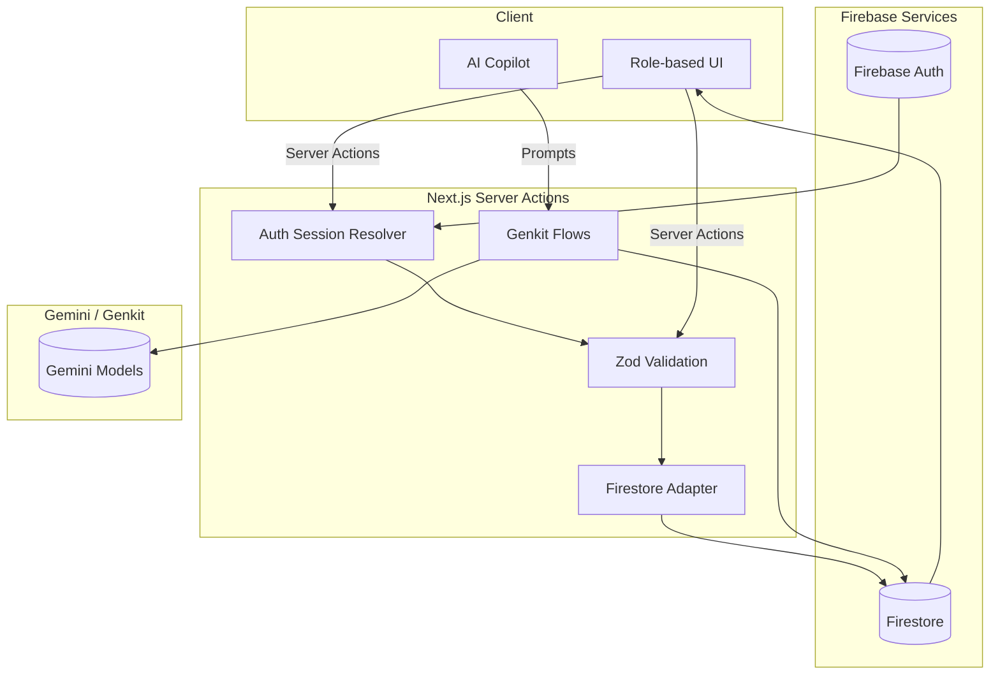

# Architecture Overview

## Platform Stack
- **Framework:** Next.js App Router with TypeScript in strict mode.
- **UI Toolkit:** shadcn/ui components styled by Tailwind CSS.
- **State & Data:** Firebase Authentication (anonymous profile login) and Firestore for persistent state.
- **AI Services:** Genkit flows invoking Gemini models for simulations, strategic guidance, and summaries.
- **Visualization:** Recharts for interactive KPI charts and trends.
- **Validation:** Zod schemas shared across server actions and client forms.

## Data Model Summary
- **companies**: Core collection storing ERPsim company snapshots, including valuation, income, emissions, and scenario state.
- **companyMetrics**: Sub-collection keyed by period for time-series KPIs and competitor comparisons.
- **strategies**: Sub-collection under companies capturing strategic plans, revisions, and AI generated advice.
- **actionItems**: User-specific tasks linked to companies and AI outputs.
- **competitorNotes**: Shared notes per company with author metadata and timestamps.
- **scenarios**: Definitions of simulation inputs and AI generated outcomes.
- **reports**: End-of-round debriefs with scorecards and recommended actions.
- **chatSessions**: Contextual AI copilot threads with message history and references.

## Application Flow Diagram

## Rules Engine Overview
- **Access Control:** Enforced by Firestore security rules that map to role-specific collections and documents (see `security-rules.md`).
- **Validation Rules:** Zod schemas ensure all server actions and client inputs comply with Firestore document contracts.
- **AI Workflow Guards:** Server actions orchestrate Genkit flows, verifying that inputs are validated, AI responses are parsed, and writes are authorized.
- **Event Hooks:** Firestore triggers (via Cloud Functions) can propagate critical updates such as recalculating KPIs or sending notifications to role-specific dashboards.

## Module Responsibilities
- **`app/role/*`**: Pages and layouts for each team role with scoped components from `/components`.
- **`app/imports`**: Shared data import tools for loading ERPsim CSVs into Firestore using validated server actions.
- **`app/settings`**: Administrative controls for organization level configuration and AI tuning.
- **`lib/firebase`**: Initialization utilities, typed Firestore converters, and server action helpers.
- **`lib/logic`**: Domain logic such as KPI calculations, scenario simulations, and action prioritization.
- **`components`**: Reusable shadcn/ui driven UI primitives, charts, and dashboards.

Refer to `firestore-schema.ts` for concrete TypeScript types that back the collections above.
